# API de Géneros Musicales

Este repositorio contiene una pequeña API REST en Go que demuestra el funcionamiento de HTTP,
los métodos, parámetros y el manejo de datos sin utilizar frameworks externos (solo la biblioteca
estándar). El objetivo es mostrar comprensión real de cómo se construye un servidor HTTP,
se parsean query y path parameters, y se validan/almacenan datos.

La implementación original solicitaba `items` con un archivo JSON, pero aquí se trabaja con
géneros musicales almacenados en una base de datos SQLite (`./data/music.db`). Cada género
tiene un `id` y al menos 5 campos adicionales (name, origin, decade, mood, tempo, description).

## Estructura del proyecto

```
├── Dockerfile                # Imagen base para Docker (opcional)
├── docker-compose.yml        # Composición para levantar el contenedor
├── go.mod                    # Módulo de Go
├── main.go                   # Código fuente del servidor
├── README.md                 # Este documento
├── data/
│   └── music.db              # Base de datos SQLite con >10 géneros predefinidos
└── images/                   # Capturas de pruebas y evidencias
    ├── server.png
    ├── get_todos.png
    ├── get_1.png
    ├── get_ruta.png
    ├── post.png
    ├── put.png
    ├── patch.png
    ├── delete.png
    ├── caso_400.png
    └── caso_404.png
```

## Requisitos cumplidos

- ✅ Repositorio con el código.
- ✅ Estructura organizada y sin archivos comprimidos.
- ✅ Base de datos con al menos 10 elementos (géneros) y cada uno con id y 5+ campos.
- ✅ Endpoints implementados con métodos HTTP (GET, POST, PUT, PATCH, DELETE).
- ✅ Consulta por query parameter (`/api/genres?id=1`).
- ✅ Path parameter (`/api/genres/1`).
- ✅ Validación robusta de datos y manejo de errores con respuestas JSON estructuradas.
- ✅ Persistencia real mediante SQLite.
- ✅ Ejemplos de filtros combinados y manejo de errores HTTP 4xx/5xx.
- ✅ Dockerfile funcional.
- ✅ Documentación clara con ejemplos de uso (este README).

> **Nota:** El servidor corre por el puerto `24347`.

## Ejecutar el servidor

Compilar y ejecutar con Go:

```bash
cd ejercicio_4_api_json_sistemas_y_tecnologias_web
go run main.go
```

También puede construir la imagen y usar Docker:

```bash
docker build -t genres-api .
docker run -p 24347:24347 genres-api
# o con docker-compose
docker-compose up --build
```

Al iniciar verá en la consola:

```
Connected to music.db
Server running on :24347
```
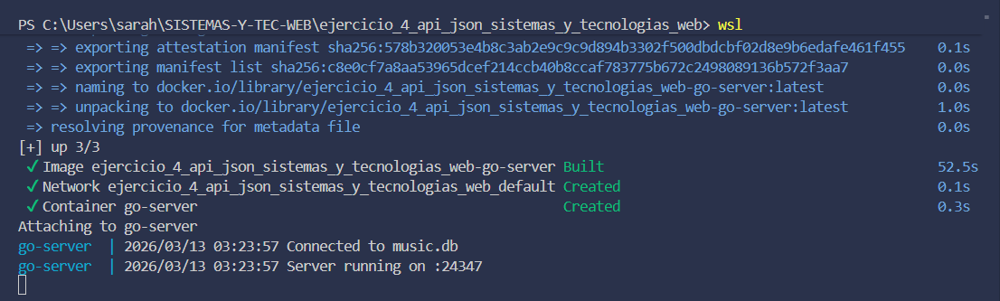

*(la siguiente captura muestra la API corriendo dentro de un servidor remoto llamado prendan el server)*

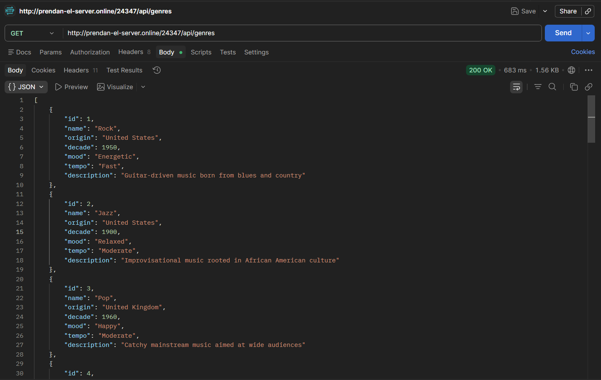

## Endpoints disponibles

Todos los endpoints devuelven y aceptan JSON (`Content-Type: application/json`).

### `GET /api/ping`
- **Descripción:** Ping de salud.
- **Respuesta:** `{ "message": "pong" }`.

### `GET /api/genres`
- Devuelve la lista completa de géneros.
- Soporta query parameter `id` para filtrar por identificador:
  `GET /api/genres?id=1` devuelve solo el género con id 1.

**Ejemplo curl:**
```bash
curl http://localhost/api/genres
curl http://localhost/api/genres?id=2
```

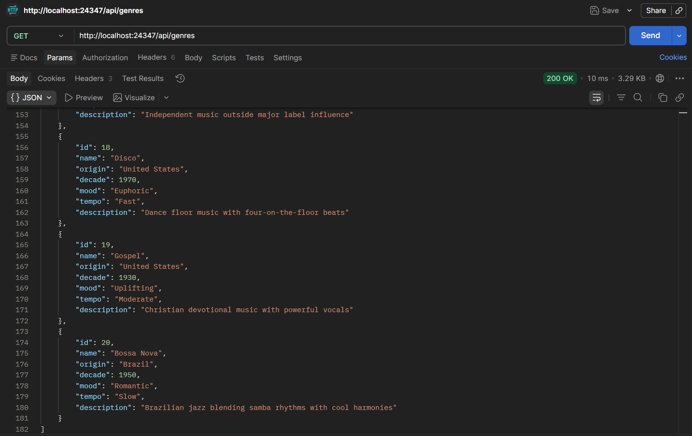
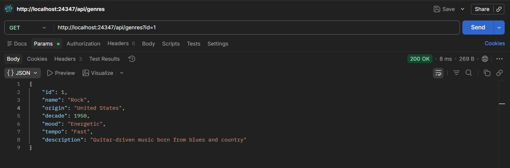

### `GET /api/genres/{id}`
- Path parameter para obtener un único género.
- Ejemplo: `GET /api/genres/5`.

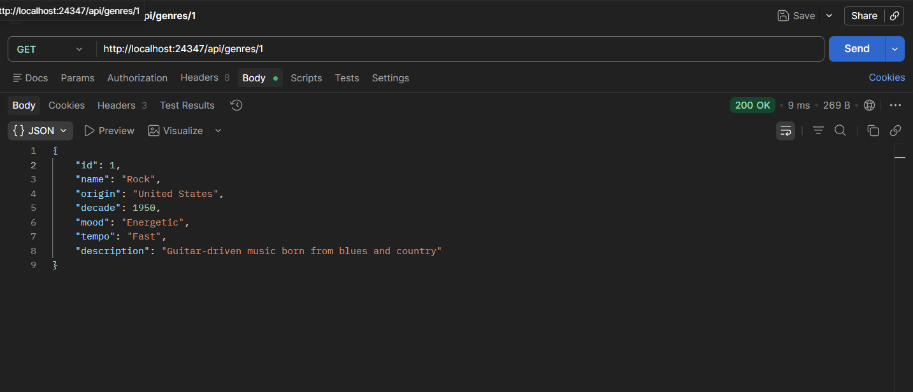

### `POST /api/genres`
- Crea un nuevo género. El cuerpo debe incluir `name`, `origin`, `decade`, `mood`,
  `tempo` y `description`.
- Retorna `201 Created` con el objeto completo (incluyendo el `id` asignado).

```json
POST /api/genres
Content-Type: application/json
{
  "name":"Synthwave",
  "origin":"Global",
  "decade":2000,
  "mood":"Nostalgic",
  "tempo":"Moderate",
  "description":"Electronic music inspired by 80s synths"
}
```

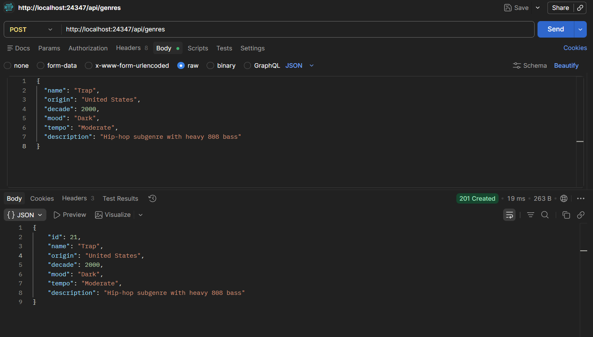

### `PUT /api/genres/{id}`
- Reemplaza completamente un género existente. Todos los campos son obligatorios.

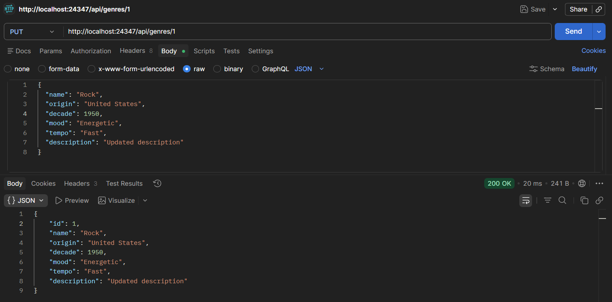

### `PATCH /api/genres/{id}`
- Actualiza parcialmente uno o más campos.

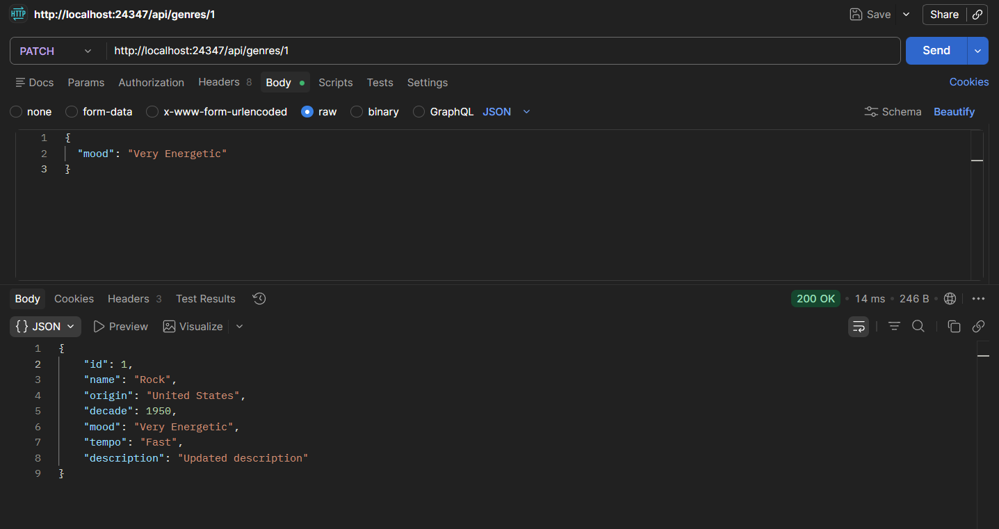

### `DELETE /api/genres/{id}`
- Elimina el género indicado.

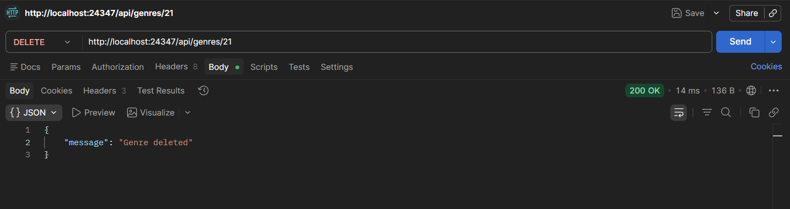

### Manejo de errores

- 400 Bad Request: JSON inválido, campos requeridos ausentes, parámetros erróneos.
- 404 Not Found: recurso no existe.
- 409 Conflict: nombre de género duplicado.

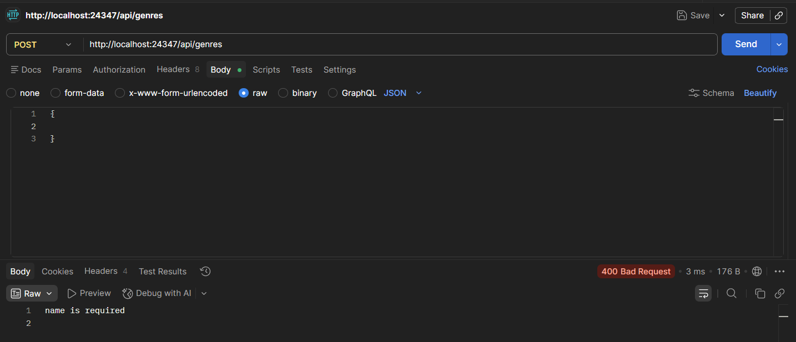
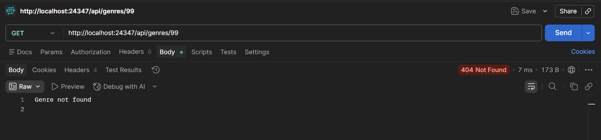

## Pruebas y evidencias

Se recomienda usar Postman, Insomnia o `curl` para probar los endpoints. Deben recopilarse las siguientes evidencias obligatorias:

### Evidencia obligatoria

1. **Servidor corriendo** — Captura de la terminal con "Connected to music.db" y "Server running on :80" (o el puerto asignado).

2. **GET todos los elementos**  
   `GET http://localhost:80/api/genres`

3. **GET con query parameter**  
   `GET http://localhost:80/api/genres?id=1`

4. **POST exitoso**  
   `POST http://localhost:80/api/genres`  
   Body (JSON):  
   ```json
   {
     "name": "Trap",
     "origin": "United States",
     "decade": 2000,
     "mood": "Dark",
     "tempo": "Moderate",
     "description": "Hip-hop subgenre with heavy 808 bass"
   }
   ```

5. **Un caso de error**  
   `POST http://localhost:80/api/genres`  
   Body (JSON): `{}`  
   → Debe retornar `400 Bad Request: name is required`

### Para puntos extra (métodos adicionales)

- **GET con path parameter**  
  `GET http://localhost:80/api/genres/1`

- **PUT — reemplazar género completo**  
  `PUT http://localhost:80/api/genres/1`  
  Body:  
  ```json
  {
    "name": "Rock",
    "origin": "United States",
    "decade": 1950,
    "mood": "Energetic",
    "tempo": "Fast",
    "description": "Updated description"
  }
  ```

- **PATCH — actualizar solo un campo**  
  `PATCH http://localhost:80/api/genres/1`  
  Body:  
  ```json
  {
    "mood": "Very Energetic"
  }
  ```

- **DELETE**  
  `DELETE http://localhost:80/api/genres/{id}` (usar el ID del género creado en el POST)

- **Segundo caso de error — ID que no existe**  
  `GET http://localhost:80/api/genres/9999`  
  → Debe retornar `404 Not Found: Genre not found`

Guarde estas capturas en la carpeta `images/` (ya incluidas en este README) para el entregable.

## Extensiones sugeridas (puntos adicionales)

- Se pueden combinar múltiples filtros agregando nuevos parámetros de consulta.
- La base de datos SQLite satisface la persistencia real.
- El repositorio está limpio y con commits semánticos.
- El `Dockerfile` permite empaquetar y desplegar fácilmente.

## Conclusión

Esta API demuestra el entendimiento del funcionamiento de HTTP, gestión de métodos,
parámetros de consulta y ruta, validación de datos y manejo de errores, así como la
persistencia en un archivo JSON/SQLite sin frameworks externos. El README documenta
todas las operaciones y brinda ejemplos claros para su uso.
